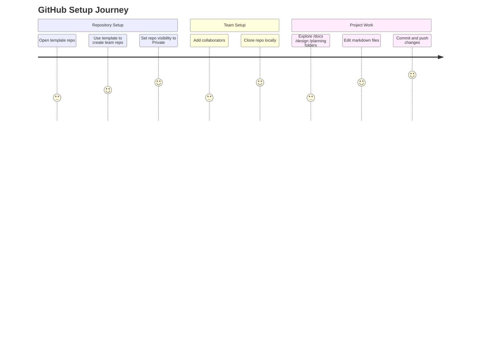

# CMP-5012B Student Guide: Getting Started with the GitHub Template

This guide explains how your team should create and set up your GitHub repository for the Software Engineering project using the official module **Template Repository**.

Total setup time: **10 minutes**.




---

### New to GitHub?
Read [Getting Started (Web Browser Only)](web-only-setup.md) for information on working directly with the web interface.

For local workflow, we recommend using GitHub desktop. See the [GitHub Desktop Quick Start](github-desktop-quick-start.md) guide.

---

# 1. One Team Member Creates the Repository

Only *one* person in the team should do this.

## Step 1: Go to the module template

Your lecturer will share the link (example):

```
https://github.com/<org>/cmp-5012b-template
```

## Step 2: Click **“Use this template” → “Create a new repository”**

You will be asked to provide:

### Repository name  
Use a clear team name, such as:

```
cmp5012b-team-delta
cmp5012b-smartparking
cmp5012b-group12
```

### Description  
Optional but recommended:

```
CMP-5012B Software Engineering – Team Delta
```

### Visibility  
Select **Private**.

Then click **Create repository**.

GitHub will generate a brand new repo containing the full starter structure.

---

# 2. Add Your Team Members to the Repository

Go to:

```
Settings → Collaborators and Teams → Add People
```

Add your teammates using their GitHub usernames.  
They will receive an invitation to join.

---

# 3. Clone the Repository

Each team member should clone the repo to their own laptop.

### Using GitHub Desktop
- Click **Code → Open with GitHub Desktop**
- Choose a folder → **Clone**

### Using command line
```bash
git clone https://github.com/<org>/<team-repo>.git
```

---

# 4. Explore the Repository Structure

The repo contains the folders you will fill during the module:

```
/docs      → Vision, user stories, acceptance criteria, personas, rationale
/design    → C4 diagrams, wireframes, sequence diagrams, data model
/planning  → Sprint plan, tasks, roadmap, risk register
/src       → (optional) your implementation, added later
```

This structure aligns with the labs and coursework.

---

# 5. Editing Markdown Files (`.md`)

Markdown is a simple text format that GitHub renders nicely.

### Headings
```
# Title
## Subtitle
### Section
```

### Lists
```
- item 1
- item 2
```

### Bold / italic
```
**bold**
*italic*
```

### Images
```

```

---

# 6. Making Commits

To save your work:

```bash
git add .
git commit -m "Add initial vision and stakeholder map"
git push
```

Or use GitHub Desktop.

**Tip:** Commit small and often so your team can collaborate smoothly.

---

# 7. Creating Branches (Recommended)

Branches help avoid conflicts.

```bash
git checkout -b feature/user-stories
```

Do your work → commit → push → open a Pull Request (PR).

Your team can review the changes before merging into `main`.

---

# 8. Using GitHub Projects or Trello

Set up a Kanban board with:

- **Backlog**  
- **In Progress**  
- **Review**  
- **Done**

Add each user story or task as a card.  
This will support your planning work.

---

# 9. Keep Documentation Inside the Repo

All required coursework artefacts should be stored here:

- Vision  
- Stories  
- Acceptance criteria  
- C4 diagrams  
- Wireframes  
- Sequence diagrams  
- Sprint plan  
- Risks  
- Final integrated report  

This keeps everything version-controlled and easy for markers to review.

---

# 10. Before Submission

1. Finalise your report (PDF or Markdown).  
2. Check diagrams display correctly in GitHub.  
3. Ensure the README lists all team members.  
4. Ensure the repo looks tidy and professional.

---

# You're Ready to Begin!

Your GitHub repo is the **central home** for your entire Software Engineering project:

- Requirements  
- Architecture  
- UX  
- Planning  
- Implementation  

This reflects real industry practice and prepares you for the coding phase in Week 7.
